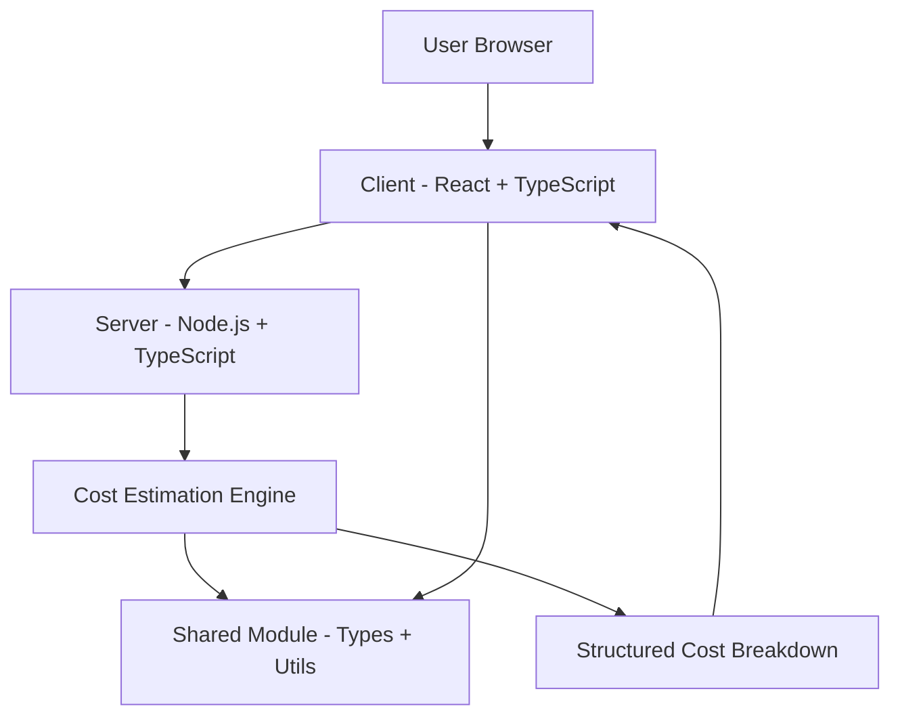

# IT Service Cost Estimator

Full-stack IT service cost estimator built as a TypeScript monorepo with shared modules across client and server. Helps businesses scope and price web application development and digital marketing projects with structured cost breakdowns.

**Engineering concept:** Full-stack TypeScript monorepo, shared module architecture, service scoping and pricing system.

## Architecture

## Tech Stack

| Layer        | Technology                          |
| ------------ | ----------------------------------- |
| Language     | TypeScript                          |
| Frontend     | React, TypeScript                   |
| Backend      | Node.js, TypeScript                 |
| Architecture | Monorepo - client / server / shared |
| Styling      | Tailwind CSS                        |
| Build Tool   | Vite                                |
| License      | MIT                                 |

## Project Structure

├── client/              # React frontend application  
├── server/              # Node.js backend API  
├── shared/              # Shared types, utilities, constants  
├── attached_assets/     # Project assets and documentation  
├── components.json      # UI component configuration  
├── design_guidelines.md # Design system reference  
├── drizzle.config.ts    # Database ORM configuration  
├── package.json  
├── tailwind.config.ts  
├── tsconfig.json  
├── vite.config.ts  
└── README.md  

## How the System Works

1. User selects the type of IT service (web app development, digital marketing, etc.)
2. User inputs project parameters — scope, features, timeline, scale
3. Cost estimation engine calculates pricing based on defined service rates
4. Structured cost breakdown is returned: development, design, maintenance, marketing
5. User can export or share the estimate

## How to Run Locally
git clone https://github.com/Jagmohan-Prajapati/IT-Service-Cost_estimator.git  
cd IT-Service-Cost_estimator  
npm install  

Run development server
npm run dev  
Visit http://localhost:5173  

## Example Usage

Service Type: Web Application Development  
Scope: E-commerce platform  
Features: Auth, Product Catalog, Cart, Payments  
Timeline: 3 months  

### Cost Estimate

| Category        | Cost        |
|-----------------|------------|
| Development     | ₹1,20,000  |
| UI/UX Design    | ₹25,000    |
| Testing & QA    | ₹15,000    |
| Deployment      | ₹10,000    |
| **Total**       | **₹1,70,000** |
